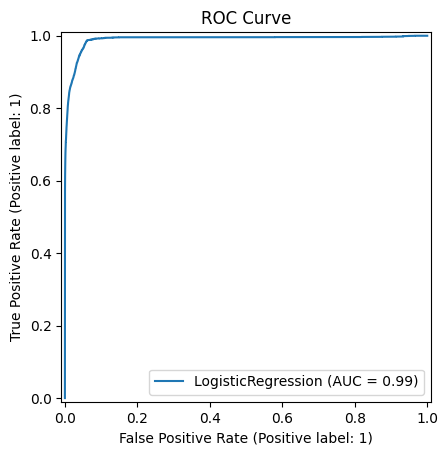

# Financial Transaction Risk & Fraud Analytics

End-to-end risk scoring project using large-scale financial transaction data (PaySim) to detect rare fraudulent activity under severe class imbalance.  
Focus: **operational decision-making**, **PR-AUC**, and **top-K risk capture** for real-world review queues.

---

## Problem
Given millions of transactions where fraud is extremely rare (~0.13%), build a model that ranks transactions by risk so a limited manual review team can capture most fraud efficiently.

---

## Approach
- **Preprocessing:** type cleaning, leakage-safe handling, time-aware evaluation
- **Feature engineering:** balance consistency checks, relative amount features, log transforms, interpretable transaction type encoding
- **Model:** class-weighted Logistic Regression (baseline risk model)
- **Evaluation:** PR-AUC (primary), ROC-AUC (secondary), threshold tuning, **top-K capture** (review queue simulation)

---

## Results
**Overall**
- ROC-AUC: **0.99**
- PR-AUC: **0.71**

**Operational performance (Top-K capture)**
| Review Budget | Fraud Captured |
|---:|---:|
| Top 0.1% | ~30% (precision ~100%) |
| Top 0.5% | ~71% |
| Top 1% | ~79% |
| Top 5% | ~96% |

> Interpretation: reviewing as little as the **top 1%** highest-risk transactions captures ~**79%** of fraudulent activity.

---

## Visualizations



---

## Reproducibility
This repo excludes raw and processed CSVs from version control.

Place the PaySim dataset locally at:

```bash
data/raw/paysim.csv
